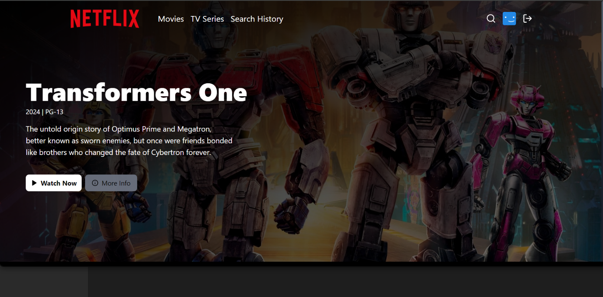

## 📺 Netflix Clone – Full Stack Application

A fully functional, responsive **Netflix Clone** built with the **MERN stack (MongoDB, Express, React, Node.js)**. This clone replicates core Netflix functionality like user authentication, movie browsing, trailers, saving to watchlist, and more.

---


### 📸 Screenshots



### 📦 Tech Stack

#### 🔧 Frontend:

* React.js
* Tailwind CSS / Styled Components
* Axios
* React Router DOM
* Firebase (for auth and hosting) or JWT-based custom auth
* TMDB API (for movies data)

#### 🛠 Backend:

* Node.js
* Express.js
* MongoDB (Mongoose)
* JSON Web Tokens (JWT)
* Multer (optional – for file uploads)

---

### ✨ Features

* 🔐 User authentication (Signup/Login/Logout)
* 🎥 Browse popular, trending, top-rated movies (from TMDB)
* ⭐ Add/remove movies to **My List**
* 🔍 Search by title
* 📺 Watch trailers
* 📱 Responsive UI (Mobile/Desktop)
* ☁️ Optional: File uploads for admin movie poster hosting

---


---

### ⚙️ Getting Started

#### Clone the repository

```bash
git clone https://github.com/your-username/netflix-clone-fullstack.git
cd netflix-clone-fullstack
```

---

#### 🔧 Backend Setup

```bash
cd server
npm install
npm run dev
```

Create a `.env` file in `server/` and add:

```env
PORT=5000
MONGO_URI=your_mongo_db_connection_string
JWT_SECRET=your_secret_key
TMDB_API_KEY=your_tmdb_api_key
```

---

#### 🌐 Frontend Setup

```bash
cd client
npm install
npm start
```

Create a `.env` file in `client/` and add:

```env
REACT_APP_TMDB_API_KEY=your_tmdb_api_key
REACT_APP_BACKEND_URL=http://localhost:5000
```

---

### 🔒 Authentication Options

You can use:

* 🔐 Firebase Auth
* 🔐 JWT-based Auth + Bcrypt password hashing

---

### 📡 API Integration

* Movie data comes from [TMDB API](https://www.themoviedb.org/documentation/api)
* Secure API requests using your `.env` key

---

### 🗃️ Database

MongoDB is used to store:

* User info
* Saved movie list
* Movie meta (if needed)

---

### ✅ Todos / Improvements

* [ ] Dark Mode toggle
* [ ] Profile avatars
* [ ] Multi-profile support
* [ ] Admin dashboard for content upload
* [ ] Payment integration for plans

---

### 🧑‍💻 Contributing

Contributions are welcome! Feel free to fork, improve and submit a PR.

---

### 📄 License

[MIT](LICENSE)

---

### 🙋‍♂️ Author

* GitHub: [your-github](https://github.com/AGUNAN)
* Portfolio: [your-portfolio-link.com](https://your-portfolio-link.com)

---

Would you like this exported as a **Markdown file** or want help adding **GIF walkthroughs**, **auth flow diagrams**, or deploying it to **Render/Vercel**?

Let me know, and I’ll assist you further.
